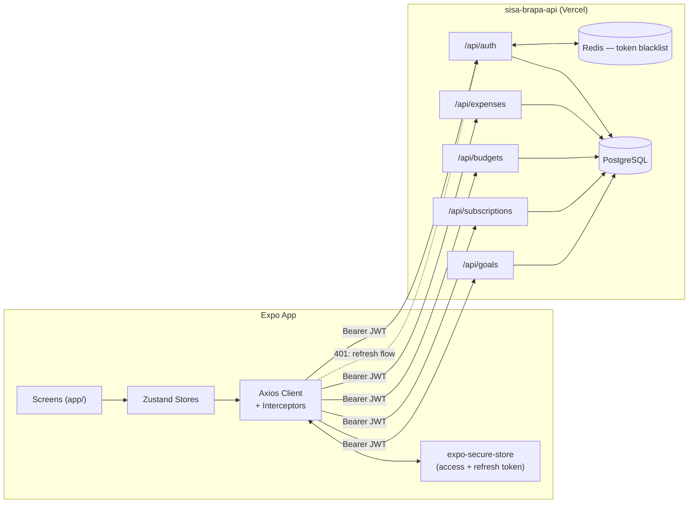

# PRD — Sisa Brapa Mobile App (Expo)

**Status:** Draft v1
**Scope:** Mobile only (Expo / React Native). Web (Next.js) is out of scope for this document.
**Backend:** [`sisa-brapa-api`](https://sisa-brapa-api.vercel.app/docs/) — already built and deployed.

---

## 1. Why this exists

The API is done. The mobile app is where the product actually becomes usable day-to-day — this is the surface people will open five times a day to log a coffee or check if they're about to blow their food budget. The job of this document is to pin down _what "done" looks like for v1_, in what order we build it, and how the pieces fit together — so we're not improvising architecture decisions three screens in.

---

## 2. Goals

**Primary goal:** ship a working, installable-on-a-real-phone app (via Expo Go first) that lets a user register, log in, and fully manage their expenses, budgets, subscriptions, and savings goals against the live API — with no dead ends and no fake data.

Concretely, v1 is "done" when a user can, without touching a web dashboard:

1. Create an account and stay logged in across app restarts
2. Add, edit, and delete an expense in under 10 seconds
3. See where their money went this month, by category
4. Set a monthly budget and get warned when they're close to blowing it
5. Track a subscription and see when it's next due
6. Log progress toward a savings goal and see the running total

**Explicitly not v1 goals:** push notifications, biometric lock, offline-first sync, dark mode polish, onboarding/splash slider. These come after core features work end-to-end — same call already made in the original planning doc, just re-affirmed here.

---

## 3. Tech Stack

| Layer            | Choice                                                  | Notes                                                                                                                                              |
| ---------------- | ------------------------------------------------------- | -------------------------------------------------------------------------------------------------------------------------------------------------- |
| Framework        | **Expo (React Native)** + TypeScript                    | Managed workflow, no native folders                                                                                                                |
| Navigation       | **Expo Router**                                         | File-based routing, mirrors Next.js App Router                                                                                                     |
| Dev loop         | **Expo Go**                                             | Real device via QR/Wi-Fi — no emulator needed for v1                                                                                               |
| Styling          | **NativeWind (Tailwind for RN)**                        | Already scaffolded (`tailwind.config.js`, `global.css`, `nativewind-env.d.ts`)                                                                     |
| State            | **Zustand**                                             | `authStore`, `expenseStore`, `budgetStore`, etc.                                                                                                   |
| HTTP client      | **Axios**                                               | Single instance with interceptors for auth + refresh                                                                                               |
| Token storage    | **expo-secure-store**                                   | JWT/refresh token must not sit in AsyncStorage in plaintext — this wasn't in the original stack list but it's a hard requirement once auth is real |
| Forms/validation | **Zod** (shared shape with backend) + `react-hook-form` | Keeps validation errors consistent with API error format                                                                                           |
| Charts           | **victory-native** or **react-native-gifted-charts**    | For category breakdown + trend screens (Section 6, Phase 5)                                                                                        |

---

## 4. Architecture Flow



**How auth actually flows in the app:**

1. Login/register hits `/api/auth`, response gives access + refresh token → both go into `expo-secure-store`, never into Zustand state directly (state only holds the decoded user + a boolean `isAuthenticated`).
2. Axios request interceptor attaches `Authorization: Bearer <access_token>` from secure storage.
3. Axios response interceptor watches for `401` → calls `/api/auth/refresh` once, retries the original request, and if refresh also fails, clears storage and routes to `(auth)/login`.
4. Logout calls `/api/auth/logout` (so the token actually gets blacklisted server-side, not just deleted locally) then clears secure storage.

This interceptor is the single most important piece of infrastructure to get right early — every other screen depends on it silently working.

---

## 5. Folder Structure

Following your actual project layout — **no `app/src` split**, everything flat at root:

```text
sisa-brapa-mobile/
├── app/                      # Expo Router — screens & layouts only
│   ├── (auth)/
│   │   ├── login.tsx
│   │   └── register.tsx
│   ├── (tabs)/
│   │   ├── _layout.tsx       # Tab bar: Home, Transactions, Budgets, Profile
│   │   ├── index.tsx         # Dashboard
│   │   ├── transactions.tsx  # Expense list + filters
│   │   ├── budgets.tsx
│   │   └── profile.tsx
│   ├── expense/
│   │   ├── [id].tsx          # Edit expense
│   │   └── new.tsx           # Add expense
│   ├── _layout.tsx           # Root layout — providers, fonts, auth guard
│   └── index.tsx             # Redirect: authed → tabs, else → login
│
├── components/                # Reusable UI (Button, Card, Input, ExpenseListItem…)
├── hooks/                     # useAuth, useExpenses, useBudgetStatus…
├── constants/                 # Colors, categories enum, API base URL
├── scripts/                   # One-off/dev scripts (already scaffolded)
├── assets/                    # Images, fonts
│
├── stores/                    # Zustand: authStore.ts, expenseStore.ts, budgetStore.ts…
├── services/                  # api.ts (Axios instance), auth.service.ts, expense.service.ts…
├── types/                     # Shared TS types mirroring API DTOs (zero `any`)
│
├── app.json
├── babel.config.js
├── tailwind.config.js
├── global.css
├── tsconfig.json
└── package.json
```

`stores/`, `services/`, and `types/` are new top-level folders (siblings to `app/`, not nested inside it) — keeps navigation code in `app/` completely separate from logic, without reintroducing a `src/` wrapper.

---

## 6. Task Breakdown (mapped to your actual API)

Each phase only unlocks screens the backend can already fully support — nothing is built against a stub.

### Phase 0 — Foundation

- [ ] Configure `services/api.ts`: Axios instance, base URL from `.env` / `constants/`, request/response interceptors
- [ ] Build `authStore` (Zustand): `user`, `isAuthenticated`, `login()`, `logout()`, `hydrate()`
- [ ] Wire `expo-secure-store` get/set/delete helpers
- [ ] Root `_layout.tsx` auth guard: redirect based on `authStore.isAuthenticated`

### Phase 1 — Auth (`/api/auth`)

- [ ] `(auth)/register.tsx` — form + Zod validation, calls register endpoint
- [ ] `(auth)/login.tsx` — calls login, stores tokens, redirects to `(tabs)`
- [ ] Silent refresh on 401 (interceptor, see Section 4)
- [ ] Logout action from Profile screen

### Phase 2 — Expenses (`/api/expenses`)

- [ ] `(tabs)/transactions.tsx` — list, pull-to-refresh, filter by category/date range
- [ ] `expense/new.tsx` — create expense (title, amount, category, date, note)
- [ ] `expense/[id].tsx` — edit/delete
- [ ] `(tabs)/index.tsx` (Dashboard) — today/this-month total, recent 5 transactions

### Phase 3 — Budgets (`/api/budgets`)

- [ ] `(tabs)/budgets.tsx` — list active budgets per category with progress bar
- [ ] Create/edit budget (per category or "all category")
- [ ] Visual warning state when spend crosses ~80%/100% of limit — this is the feature that actually makes the app useful, don't leave it for later

### Phase 4 — Subscriptions (`/api/subscriptions`)

- [ ] Subscription list with next-due-date and status badge (active/pending/cancelled/expired)
- [ ] Create/edit subscription, billing cycle picker (weekly/monthly/yearly)

### Phase 5 — Goals (`/api/goals`)

- [ ] Goals list with progress toward target
- [ ] Goal detail → Saving Log (deposit history)
- [ ] "Add to savings" action

### Phase 6 — Analytics

- [ ] Category breakdown chart (from `/api/expenses` analytics endpoints)
- [ ] Trend view (7d/30d/6mo) + Month-over-Month comparison on Dashboard

### Deferred (post-v1)

- Excel/PDF export from mobile (API already supports it — low priority since it's primarily a desktop/web use case)
- Push notifications for budget threshold + subscription due dates
- Onboarding/splash flow
- Dark mode

---

## 7. Design System — Vercel via getdesign.md

`npx getdesign@latest add vercel` is a legitimate tool — it's a plain-markdown design brief (`DESIGN.md`) with tokens, type scale, spacing, and component rules an AI agent can follow, from the [getdesign.md](https://getdesign.md) catalog by VoltAgent.

Worth being honest about the fit before you install it, though: **Vercel's system is black-and-white, Geist-font, monochrome-precision** — built for a developer platform, not a finance app. For screens with charts, budget-progress bars, and category tags, pure monochrome makes the actual _information_ (over-budget vs. under-budget, category colors) harder to read at a glance. A finance app leans on color to communicate state — that's not optional decoration, it's the UI doing its job.

Two reasonable paths:

1. **Use `vercel` as the base, layer a semantic color system on top** — keep the clean typography/spacing/component discipline, but define your own `success` / `warning` / `danger` tokens (green/amber/red) for budget states, and category colors, on top of the neutral base. This is probably the pragmatic choice since you already like the aesthetic.
2. **Consider `stripe` or `linear` instead** — both are in the same catalog, both are fintech-adjacent or data-dense-friendly out of the box, and would need less overriding for a money app specifically.

Either way: run the command, drop `DESIGN.md` at the project root, then explicitly extend it with a small `constants/theme.ts` that maps semantic states (over-budget, near-limit, healthy, goal-complete) to actual colors — don't let the agent improvise those from a monochrome base each time.

---

## 8. Open Questions (flag before Phase 2)

- Does `/api/expenses` return paginated results? Affects whether `transactions.tsx` needs infinite scroll from day one.
- Confirm exact refresh-token endpoint path and expiry — needed to get the Phase 0 interceptor right the first time.
- Category list: is it a fixed enum from the API/schema, or user-defined? Determines whether categories live in `constants/` or get fetched.
