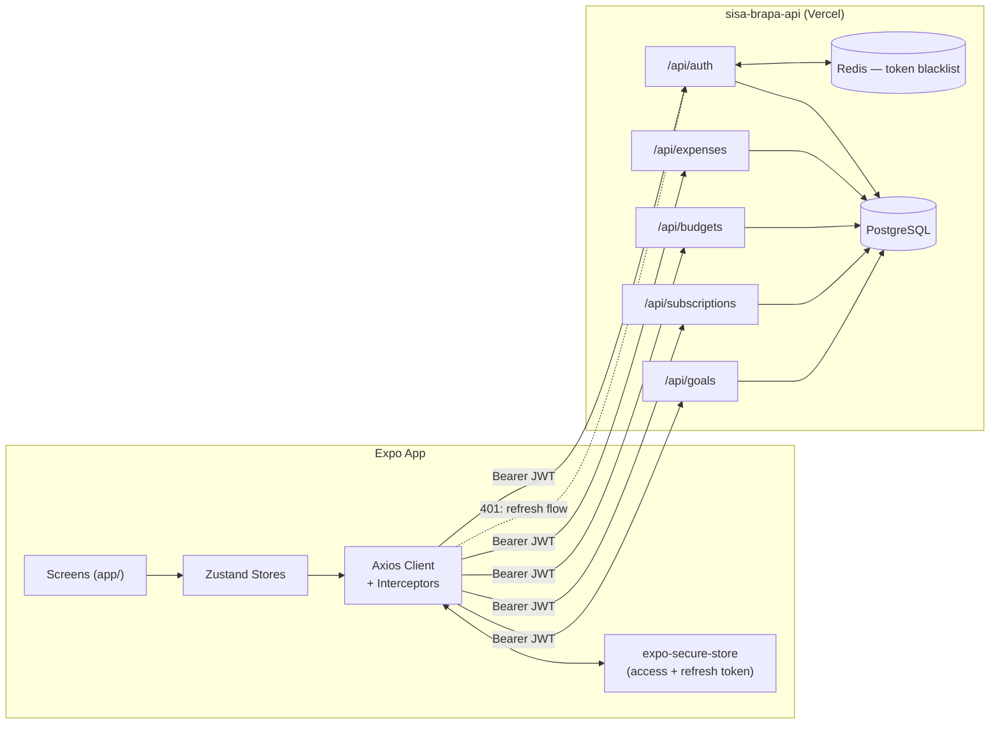

# PRD — Sisa Brapa Mobile App (Expo)

**Status:** Draft v1
**Scope:** Mobile saja (Expo / React Native). Web (Next.js) di luar cakupan dokumen ini.
**Backend:** [`sisa-brapa-api`](https://sisa-brapa-api.vercel.app/docs/) — sudah dibangun dan deployed.

---

## 1. Kenapa dokumen ini dibuat

API-nya udah kelar. Mobile app adalah tempat produk ini beneran jadi berguna sehari-hari — inilah layar yang bakal dibuka orang lima kali sehari cuma buat nyatet kopi atau ngecek apakah budget makan udah mau jebol. Fungsi dokumen ini: mastiin "selesai" itu artinya apa untuk v1, urutan pengerjaannya gimana, dan gimana semua bagian nyambung — biar kita nggak dadakan ambil keputusan arsitektur pas udah di tengah-tengah bikin layar.

---

## 2. Goals

**Goal utama:** ship aplikasi yang beneran jalan dan bisa di-install di HP fisik (via Expo Go dulu) yang bikin user bisa register, login, dan kelola penuh expense, budget, subscription, dan savings goal langsung ke API live — nggak ada dead end, nggak ada data palsu.

Secara konkret, v1 dianggap "selesai" kalau user bisa, tanpa buka web dashboard sama sekali:

1. Bikin akun dan tetap login walau app di-restart
2. Nambah, edit, dan hapus expense dalam waktu kurang dari 10 detik
3. Lihat uangnya kemana aja bulan ini, per kategori
4. Set budget bulanan dan dapet warning kalau udah mepet limit
5. Track subscription dan lihat kapan jatuh temponya
6. Catat progress ke savings goal dan lihat total yang udah kekumpul

**Yang eksplisit BUKAN goal v1:** push notification, biometric lock, offline-first sync, dark mode yang polished, onboarding/splash slider. Ini semua nyusul setelah fitur inti jalan end-to-end — sama kayak keputusan di dokumen rencana awal, cuma gua tegasin lagi di sini.

---

## 3. Tech Stack

| Layer         | Pilihan                                                 | Catatan                                                                                                                                                               |
| ------------- | ------------------------------------------------------- | --------------------------------------------------------------------------------------------------------------------------------------------------------------------- |
| Framework     | **Expo (React Native)** + TypeScript                    | Managed workflow, nggak ada folder native                                                                                                                             |
| Navigation    | **Expo Router**                                         | File-based routing, mirip Next.js App Router                                                                                                                          |
| Dev loop      | **Expo Go**                                             | Langsung ke HP fisik via QR/Wi-Fi — nggak perlu emulator buat v1                                                                                                      |
| Styling       | **NativeWind (Tailwind untuk RN)**                      | Udah ke-scaffold (`tailwind.config.js`, `global.css`, `nativewind-env.d.ts`)                                                                                          |
| State         | **Zustand**                                             | `authStore`, `expenseStore`, `budgetStore`, dst                                                                                                                       |
| HTTP client   | **Axios**                                               | Satu instance dengan interceptor buat auth + refresh                                                                                                                  |
| Token storage | **expo-secure-store**                                   | JWT/refresh token nggak boleh nongkrong di AsyncStorage secara plaintext — ini belum ada di daftar stack awal tapi jadi hard requirement begitu auth-nya beneran real |
| Form/validasi | **Zod** (bentuk sama kayak backend) + `react-hook-form` | Biar error validasi konsisten sama format error API                                                                                                                   |
| Chart         | **victory-native** atau **react-native-gifted-charts**  | Buat layar breakdown kategori + tren (Section 6, Fase 5)                                                                                                              |

---

## 4. Alur Arsitektur



**Gimana alur auth beneran jalan di app:**

1. Login/register nembak `/api/auth`, respons kasih access + refresh token → keduanya masuk ke `expo-secure-store`, JANGAN langsung ke state Zustand (state cuma nyimpen `user` yang udah didecode + boolean `isAuthenticated`).
2. Axios request interceptor nempelin `Authorization: Bearer <access_token>` dari secure storage.
3. Axios response interceptor mantau `401` → panggil `POST /api/auth/refresh` sekali (dengan refresh token yang tersimpan), retry request awal pakai `token` baru yang dibalikin, dan kalau refresh juga gagal, clear storage lalu redirect ke `(auth)/login`.
4. Logout manggil `/api/auth/logout` (biar token beneran di-blacklist di server, bukan cuma dihapus lokal) baru clear secure storage.

**Confirmed dari API:**

- Access token umur **15 menit**, refresh token umur **7 hari** — beda jauh, jadi silent refresh bakal kepake cukup sering (rata-rata tiap 15 menit pemakaian aktif). Jangan tunda proactive refresh logic ke fase belakangan.
- Response `/api/auth/refresh` cuma balikin field `token` (access token baru) — bukan `accessToken`/`refreshToken` sepasang. Berarti refresh token-nya nggak rotate, jadi cukup simpan refresh token sekali pas login dan pakai terus sampe dia sendiri expired di hari ke-7 (baru user kepaksa login ulang).
- Endpoint rate-limited (`ratelimit-limit: 200` per window 15 menit) — nggak masalah buat pemakaian normal, tapi jangan sampe ada bug yang bikin refresh dipanggil berkali-kali beruntun (misal retry loop kalau lupa handle kasus refresh gagal).

Interceptor ini adalah infrastruktur paling penting buat dibenerin dari awal — semua screen lain bergantung diam-diam sama ini jalan mulus.

---

## 5. Struktur Folder

Ngikutin layout project lu yang sekarang — **tanpa split `app/src`**, semua flat di root:

```text
sisa-brapa-mobile/
├── app/                      # Expo Router — cuma screen & layout
│   ├── (auth)/
│   │   ├── login.tsx
│   │   └── register.tsx
│   ├── (tabs)/
│   │   ├── _layout.tsx       # Tab bar: Home, Transactions, Budgets, Profile
│   │   ├── index.tsx         # Dashboard
│   │   ├── transactions.tsx  # List expense + filter
│   │   ├── budgets.tsx
│   │   └── profile.tsx
│   ├── expense/
│   │   ├── [id].tsx          # Edit expense
│   │   └── new.tsx           # Tambah expense
│   ├── _layout.tsx           # Root layout — provider, font, auth guard
│   └── index.tsx             # Redirect: udah login → tabs, belum → login
│
├── components/                # UI reusable (Button, Card, Input, ExpenseListItem…)
├── hooks/                     # useAuth, useExpenses, useBudgetStatus…
├── constants/                 # Colors, enum kategori (lihat Section 6), base URL API
├── scripts/                   # Script dev/one-off (udah ke-scaffold)
├── assets/                    # Gambar, font
│
├── stores/                    # Zustand: authStore.ts, expenseStore.ts, budgetStore.ts…
├── services/                  # api.ts (instance Axios), auth.service.ts, expense.service.ts…
├── types/                     # Tipe TS yang mirror DTO API (zero `any`)
│
├── app.json
├── babel.config.js
├── tailwind.config.js
├── global.css
├── tsconfig.json
└── package.json
```

`stores/`, `services/`, dan `types/` adalah folder top-level baru (sejajar sama `app/`, bukan nested di dalemnya) — biar kode navigasi di `app/` tetep kepisah total dari logic, tanpa balik lagi ke pola bungkus `src/`.

---

## 6. Task Breakdown (dipetain ke API lu yang beneran)

Tiap fase cuma buka screen yang API-nya emang udah support penuh — nggak ada yang dibangun ngarep stub.

### Fase 0 — Fondasi

- [ ] Setup `services/api.ts`: instance Axios, base URL dari `.env` / `constants/`, request/response interceptor
- [ ] Bikin `authStore` (Zustand): `user`, `isAuthenticated`, `login()`, `logout()`, `hydrate()`
- [ ] Wiring helper get/set/delete `expo-secure-store`
- [ ] Auth guard di root `_layout.tsx`: redirect berdasarkan `authStore.isAuthenticated`

### Fase 1 — Auth (`/api/auth`)

- [ ] `(auth)/register.tsx` — form + validasi Zod, panggil endpoint register
- [ ] `(auth)/login.tsx` — panggil login, simpan token, redirect ke `(tabs)`
- [ ] Silent refresh saat 401 (interceptor, lihat Section 4)
- [ ] Aksi logout dari screen Profile

### Fase 2 — Expenses (`/api/expenses`)

- [ ] `(tabs)/transactions.tsx` — list dengan **infinite scroll** (API confirmed paginated: `page`, `limit`, `totalPages`, `hasNext`), pull-to-refresh, filter by kategori/rentang tanggal
- [ ] `expense/new.tsx` — bikin expense (judul, nominal, kategori dari `constants/categories.ts`, tanggal, catatan)
- [ ] `expense/[id].tsx` — edit/hapus
- [ ] `(tabs)/index.tsx` (Dashboard) — total hari ini/bulan ini, 5 transaksi terakhir

**Kategori (confirmed, hardcode di `constants/categories.ts`, nggak perlu fetch):**

```ts
export const CATEGORIES = [
  'food',
  'transport',
  'entertainment',
  'health',
  'other',
] as const;
export type ExpenseCategory = (typeof CATEGORIES)[number];
```

Ini persis sama kayak enum Zod di backend — meski di Prisma kolomnya cuma `String` biasa, validasi input tetep dijaga enum ini di kedua sisi. Kalau nanti mau bikin kategori jadi user-defined, ini satu-satunya tempat yang perlu diubah plus bikin endpoint kategori baru di backend.

### Fase 3 — Budgets (`/api/budgets`)

- [ ] `(tabs)/budgets.tsx` — list budget aktif per kategori dengan progress bar
- [ ] Bikin/edit budget (per kategori atau "all category")
- [ ] Visual warning saat spending nyentuh ~80%/100% dari limit — ini fitur yang beneran bikin app-nya berguna, jangan ditunda-tunda

### Fase 4 — Subscriptions (`/api/subscriptions`)

- [ ] List subscription dengan tanggal jatuh tempo berikutnya dan badge status (active/pending/cancelled/expired)
- [ ] Bikin/edit subscription, pilihan siklus billing (weekly/monthly/yearly)

### Fase 5 — Goals (`/api/goals`)

- [ ] List goals dengan progress ke target
- [ ] Detail goal → Saving Log (riwayat setoran)
- [ ] Aksi "Tambah tabungan"

### Fase 6 — Analytics

- [ ] Chart breakdown kategori (dari endpoint analitik `/api/expenses`)
- [ ] Tampilan tren (7 hari/30 hari/6 bulan) + perbandingan Month-over-Month di Dashboard

### Ditunda (setelah v1)

- Export Excel/PDF dari mobile (API udah support, prioritas rendah karena ini lebih ke use case desktop/web)
- Push notification buat threshold budget + tanggal jatuh tempo subscription
- Flow onboarding/splash
- Dark mode

---

## 7. Design System — Vercel via getdesign.md

`npx getdesign@latest add vercel` itu tool yang legit — dia file markdown polos (`DESIGN.md`) berisi token, type scale, spacing, dan aturan komponen yang bisa diikuti AI agent, dari katalog [getdesign.md](https://getdesign.md) buatan VoltAgent.

Tapi worth jujur soal cocok-nggaknya sebelum lu install: **sistem Vercel itu hitam-putih, font Geist, presisi monokrom** — dibikin buat developer platform, bukan aplikasi finance. Buat layar yang ada chart, progress bar budget, dan tag kategori, monokrom murni bikin _informasinya_ (over-budget vs aman, warna kategori) lebih susah kebaca sekilas. Aplikasi finance itu ngandelin warna buat komunikasiin status — itu bukan dekorasi opsional, itu UI yang lagi kerja.

Dua opsi yang masuk akal:

1. **Pake `vercel` sebagai base, tumpuk sistem warna semantik di atasnya** — pertahanin kedisiplinan tipografi/spacing/komponennya, tapi definisiin token sendiri buat `success` / `warning` / `danger` (hijau/kuning/merah) buat status budget, dan warna kategori, di atas base netral tadi. Ini kemungkinan pilihan paling praktis karena lu emang udah suka estetikanya.
2. **Pertimbangin `stripe` atau `linear`** — dua-duanya ada di katalog yang sama, dua-duanya lebih dekat ke fintech atau lebih ramah data-dense dari sononya, jadi butuh override lebih sedikit khusus buat app duit.

Gimanapun juga: jalanin command-nya, taruh `DESIGN.md` di root project, terus extend secara eksplisit dengan `constants/theme.ts` kecil yang mapping state semantik (over-budget, mepet limit, sehat, goal tercapai) ke warna beneran — jangan biarin agent ngarang sendiri dari base monokrom tiap kali.

---

## 8. Pertanyaan Terbuka — Resolved ✅

| Pertanyaan                       | Jawaban                                                                                                                                                                      |
| -------------------------------- | ---------------------------------------------------------------------------------------------------------------------------------------------------------------------------- |
| Expenses paginated?              | Ya — response punya `pagination: { page, limit, totalData, totalPages, hasNext, hasPrev }`. `transactions.tsx` wajib infinite scroll / load-more, bukan fetch-sekali-render. |
| Path refresh token + durasi?     | `POST /api/auth/refresh`, balikin `{ token }` (access token doang, refresh token nggak rotate). Access token 15 menit, refresh token 7 hari.                                 |
| Kategori enum atau user-defined? | Enum tetap: `food`, `transport`, `entertainment`, `health`, `other` — dijaga Zod di backend meski kolom Prisma-nya `String`. Hardcode di `constants/categories.ts`.          |

Semua tiga udah confirmed dari API lu sendiri — nggak ada lagi yang perlu diklarifikasi sebelum mulai Fase 0.
